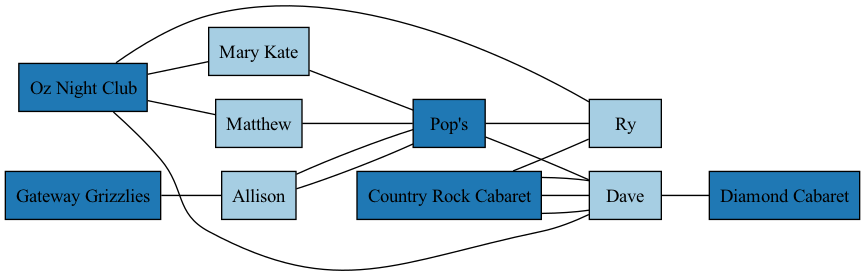
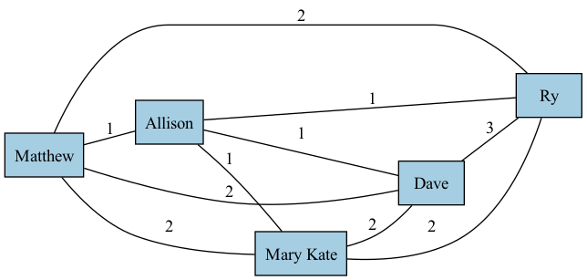
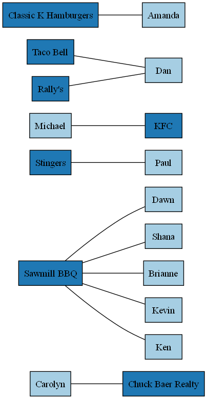
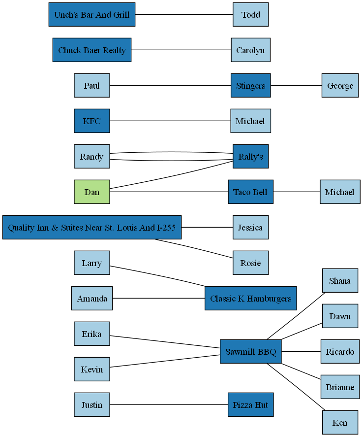
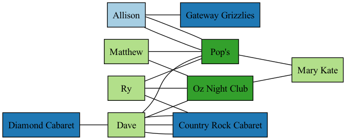
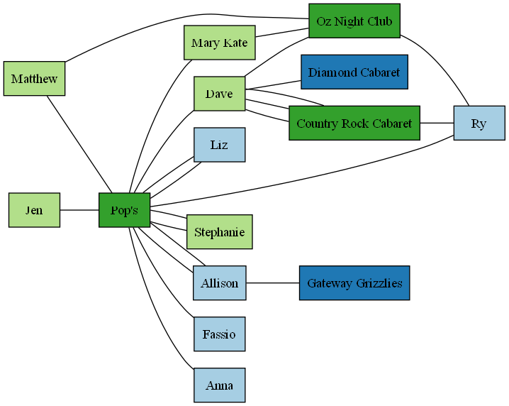
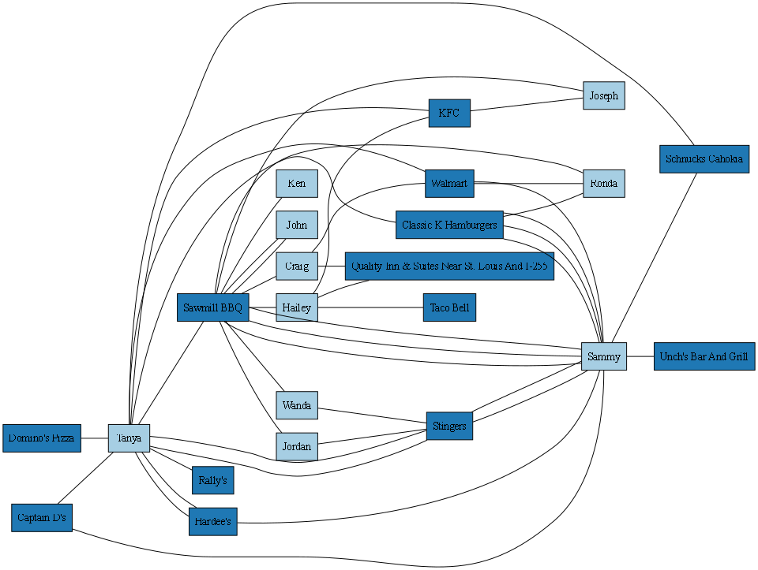

# EP02

O objetivo desta atividade é construir as funções designadas usando NetworkX.

## Orientações Gerais

* Use estritamente a estrutura já disponível, não altere nomes de arquivos ou sua localização e não altere o nome das funções, porque isto poderá inviabilizar a execução automática de testes durante o push do repositório;

* Os grupos devem implementar as soluções exclusivamente através da representação e manipulação de grafos usando NetworkX, juntamente com construções gerais de Python quando indispensável;

* Organize o código de forma consistente para facilitar sua legibilidade e apresente documentação apenas se necessário a sua compreensão. Por exemplo, evite espaçamentos entre linhas ou identação inconsistentes; use nomes de funções/variáveis significativos, documente o propósito de novas funções adicionadas e blocos lógicos mais complexos;

* Cada grupo deverá realizar este trabalho de forma individual, apresentando sua própria resposta. As respostas serão inspecionadas visualmente e mecanicamente com ferramentas especializadas. Nesta inspeção, caso seja detectada cópia de resposta, o(s) grupo(s) envolvido(s) sofrerão penalidade na nota e poderão ficar com nota 0; Caso seja detectado o uso de código gerado, a questão envolvida receberá 0 pontos;

* É importante salientar que é de responsabilidade do grupo manter o sigilo sobre sua solução. Para tal, não deixe sua solução em locais de visibilidade pública e acesso trivial;

* O trabalho deve ser realizado estritamente em grupo. A realização e entrega individual será penalizada com diminuição de 30% do valor da nota. Casos excepcionais, tais como assistência domiciliar ou desistência/indisponibilidade de membro(s) do grupo devem ser comunicados com antecedência.

## Entrega:

* Realize *push* com a versão final do repositório até o prazo definido na atividade do Google Classroom;

* Durante a fase de correção, será considerada a execução mais recente de workflows do Actions. No entanto, a equipe de ensino poderá também re-executar workflows, caso necessário;

* Caso seu projeto contenha algum erro de compilação ou testes não executam através do Actions, este não poderá ser corrigido;

* A participação de cada membro será comprovada através do histórico de edições e *commits* do repositório. A nota será dada apenas para aqueles que editarem efetivamente o repositório, utilizando o login específico atribuído no Team do GitHub (conta vinculada ao seu @ccc.ufcg.edu.br);
 
* Caso o repositório seja editado após o prazo para entrega, a atividade será considerada como reposição. Caso o grupo não tenha mais direito a reposição, não será contabilizada pontuação para a atividade.

## Organização do Repositório

* O folder `src` contém os arquivos onde as funções solicitadas neste exercício devem ser implementadas;
* o folder `test` contém testes automáticos para cada uma das funções a serem implementadas. Estes testes são automaticamente executados durante a submissão (*push*) de cada *commit* do repositório. Para executar estes testes no VSCode, use o seguinte comando no terminal, a partir do folder principal (como exemplo, considere a questão Q01). Dependendo da sua instalação, o executável de python pode ter outras denominações, como `python3`:

      python -m unittest test/test_Q01.py
 
 

* No folder principal, os trechos de código `main-<questão>.py` apresentam um ambiente para teste manual de cada função;

* O folder `graphs` possui exemplos de grafos YELP que podem ser utilizados neste exercício. Para visualizar estes grafos use o script `view_user_graph.py` no folder principal da seguinte forma (onde a opção `--connected` omite vértices isolados da visualização):

        python view_user_graph.py --graph graphs/IL/state_IL_city_Dupo.graphml

* O folder `gtufcg` contém funções para visualização gráfica.

## Domínio do Problema

[Yelp](https://www.yelp.com/) é uma plataforma online (site e aplicativo) criada em 2004 nos Estados Unidos, onde usuários avaliam e comentam sobre empresas locais, como restaurantes, bares, lojas, academias, hotéis, entre outros.
Os usuários podem dar notas de 1 a 5 estrelas, escrever reviews (comentários) e até publicar fotos dos estabelecimentos.

O [Yelp Dataset](https://www.kaggle.com/datasets/yelp-dataset/yelp-dataset) é um conjunto de dados público disponibilizado pela própria empresa Yelp para fins educacionais e de pesquisa.
Ele foi criado originalmente para a competição Yelp Dataset Challenge, com o objetivo de incentivar estudos sobre análise de sentimentos, recomendações, mineração de texto e comportamento de usuários.

Esse dataset é uma amostra real dos dados da plataforma, ou seja, não contém todas as empresas e usuários, mas um subconjunto representativo, com dados anônimos e tratados para proteger a privacidade.

O conjunto é dividido em vários arquivos (JSON ou CSV), cada um representando um tipo de informação:

Arquivo / Tabela	| Campos principais |	Descrição
--------------------|--------------------|-----------------------------
business	| business_id, name, address, city, state, stars, categories	| Informações sobre cada negócio (nome, localização, nota média, tipo de negócio, etc.). Uma mesma empresa pode ter business_id diferentes para cada endereço diferente
review	| review_id, user_id, business_id, stars, date, text	| Comentários e avaliações escritas pelos usuários sobre os estabelecimentos
user |	user_id, name, review_count, yelping_since, average_stars |	Dados sobre os usuários (número de reviews, média de notas, tempo de uso, etc.)
checkin | 	business_id, time |	Registros de check-ins (momentos em que usuários visitaram o local)
tip |	user_id, business_id, text, date	| Dicas rápidas ou comentários curtos deixados pelos usuários
photo	| photo_id, business_id, caption	| Fotos enviadas pelos usuários relacionadas aos estabelecimentos

O dataset foi extraído diretamente da base real do Yelp, passando por filtragem geográfica (selecionando cidades e regiões representativas), anonimização (remoção de nomes reais de pessoas e informações sensíveis), conversão para formato aberto (JSON/CSV) e publicação para uso acadêmico no Kaggle e no site oficial do Yelp Open Dataset.

Neste exercício, estaremos utilizando dados de `business`, `user` e `review`, os quais foram extraídos dos arquivos JSON originais e representados como grafos. 

A seguir apresentamos um exemplo de um grafo não-direcionado (Grafo `graphs/s_25_5.graphml`) gerado a partir destes dados para uso neste exercício. Nele, estão representados as entidades `user` e `business` como vértices e `review` como arcos. Como um usuário (`user`) pode realizar mais de uma revisão (`review`) para um mesmo negócio (`business`), o grafo é um multigrafo. Cada vértice e aresta possui um atributo `type` que indica o tipo do vértice/aresta. Neste exercício, denominado de **grafo** **YELP** todo grafo que apresenta este formato. Este grafo deve sempre ser construído ou importado como um multigrafo para que todas as arestas com revisões sejam incorporadas.

Exemplo de vértice do tipo `user` com atributos:

        ('2WnXYQFK0hXEoTxPtV2zvg', 
         {'type': 'user', 
          'name': 'Steph', 
          'review_count': 665, 
          'average_stars': 3.32, 
          'yelping_since': 
          '2008-07-25 10:41:00', 
          'label': 'Steph'})

onde '2WnXYQFK0hXEoTxPtV2zvg' é o identificador do vértice, correspondendo ao código do usuário no YELP academics.

Exemplo de vértice do tipo `business` com atributos:

        ('-OKB11ypR4C8wWlonBFIGw', 
         {'type': 'business', 
          'business_id': '-OKB11ypR4C8wWlonBFIGw', 
          'name': 'Atlantis Casino Resort Spa', 
          'address': '3800 S Virginia St', 
          'city': 'Reno', 
          'state': 'NV', 
          'postal_code': '89502', 
          'latitude': 39.4889071, 
          'longitude': -119.7936863, 
          'stars': 3.5, 
          'review_count': 1218, 
          'is_open': 1, 
          'attributes': '{...'}', 
          'categories': 'Casinos, Hotels & Travel, Arts & Entertainment, Resorts, Beauty & Spas, Day Spas', 
          'hours': "{'Monday': '0:0-0:0', 'Tuesday': '0:0-0:0', 'Wednesday': '0:0-0:0', 'Thursday': '0:0-0:0', 'Friday': '0:0-0:0', 'Saturday': '0:0-0:0', 'Sunday': '0:0-0:0'}", 'label': 'Atlantis Casino Resort Spa'}
        )

onde `-OKB11ypR4C8wWlonBFIGw` é o identificador do vértice, correspondendo ao código do negócio no YELP academics.

Exemplo de aresta do tipo `review` com atributos:

        ('-OKB11ypR4C8wWlonBFIGw', '2WnXYQFK0hXEoTxPtV2zvg', 
         {'type': 'review', 
          'review_stars': 3.0, 
          'review_date': '2009-03-09 08:12:47'
          }
        )

onde '-OKB11ypR4C8wWlonBFIGw' é um identificador de `business` e  '2WnXYQFK0hXEoTxPtV2zvg' é um identificador de `user`. 

## Questão 01 

Em sistemas de recomendação e análise de comportamento, não basta saber se dois usuários estão conectados. É essencial medir o quão forte é essa conexão. No contexto do Yelp, dois usuários que revisaram um único negócio em comum podem ter apenas um interesse casual compartilhado. Por outro lado, dois usuários que revisaram dezenas de negócios em comum apresentam forte afinidade de preferências, hábitos e padrões de consumo.

Implemente a função `weighted_user_graph` que recebe um grafo YELP `g` e retorna um grafo simples (classe Graph) onde cada vértice representa um usuário. Dois usuários são adjacentes se revisaram ao menos um negócio em comum. O peso da aresta (atributo `weight`) indica o número de negócios distintos que ambos revisaram. Neste grafo, múltiplas revisões do mesmo negócio por um usuário devem ser contabilizadas apenas uma vez.

Por exemplo, para  o grafo `graphs/Sauget_5_2.graphml` (abaixo ilustrado), a função deve retornar o seguinte grafo:

Grafo YELP: 

Grafo Retornado:

Note que o grafo retornado deve conter apenas os identificadores de usuários nos conjuntos de vértices e arestas. Abaixo, a saída retornada para o grafo YELP acima:

        ['TMLVzNYs-zwwREudyvI08A', 'qTMK2qr6ngof4fe29qyooA', 'qWYEuBZP7av55tewg3PXKg', 'mKBl4fAqTfNts7B78aOPVg', 'bSWWV65xqwiHf6njt1LwWg']

        [('TMLVzNYs-zwwREudyvI08A', 'qTMK2qr6ngof4fe29qyooA', {'weight': 1}), 
        ('TMLVzNYs-zwwREudyvI08A', 'qWYEuBZP7av55tewg3PXKg', {'weight': 2}),
         ('TMLVzNYs-zwwREudyvI08A', 'mKBl4fAqTfNts7B78aOPVg', {'weight': 2}),
          ('TMLVzNYs-zwwREudyvI08A', 'bSWWV65xqwiHf6njt1LwWg', {'weight': 2}),
           ('qTMK2qr6ngof4fe29qyooA', 'qWYEuBZP7av55tewg3PXKg', {'weight': 1}),
            ('qTMK2qr6ngof4fe29qyooA', 'mKBl4fAqTfNts7B78aOPVg', {'weight': 1}),
             ('qTMK2qr6ngof4fe29qyooA', 'bSWWV65xqwiHf6njt1LwWg', {'weight': 1}),
              ('qWYEuBZP7av55tewg3PXKg', 'mKBl4fAqTfNts7B78aOPVg', {'weight': 2}),
               ('qWYEuBZP7av55tewg3PXKg', 'bSWWV65xqwiHf6njt1LwWg', {'weight': 2}),
                ('mKBl4fAqTfNts7B78aOPVg', 'bSWWV65xqwiHf6njt1LwWg', {'weight': 3})]

**Arquivos**:
* src/Q01.py (local onde a função deve ser construída)
* main_Q01.py (exemplo de uso da função)

**Testes**:

        python -m unittest -v test/test_Q01.py

## Questão 02 

Em redes sociais e plataformas como YELP, alguns usuários atuam como pontos estruturais de ligação entre grupos distintos (pontos separadores de conectividade). A remoção destes usuários pode fragmentar comunidades de revisores, reduzir a propagação de informação ou até mesmo afetar mecanismos de recomendação. Uma comunidade de revisores, tal como defindo na Questão 01, é um grupo de usuários, onde cada usuário fez pelo menos uma revisão de um mesmo negócio que outro usuário do grupo. Dois usuários são adjacentes quando realizaram pelo menos uma avaliação em um negócio comum.

Implemente a função `critical_users` que recebe um grafo YELP `g` e retorna um dicionário  que tem como chave os identificadores de usuários que atuam como separadores de conectividade. Para cada vértice, deve ser associado a soma dos pesos das arestas incidentes ao mesmo no grafo de revisores. Note que estes usuários não são literalmente vértices de corte no grafo YELP, mas no grafo ponderado de revisores.

Como exemplo, considere o grafo abaixo (`graphs/Cahokia_esparso_10.graphml`). Apesar de `Dan` ser um vértice de corte, este não é um separador de conectividade.

Porém, no grafo abaixo, `Dan` é um separador de conectividade, conectando `Randy` a `Michael`. Neste caso, a função retorna: `{'hF4pvrCWNHP5LIvP5yv7KA': 2}`, onde ` hF4pvrCWNHP5LIvP5yv7KA` é o identificador de `Dan`.

**Arquivos**:

* src/Q02.py (local onde a função deve ser construída)
* main_Q02.py (exemplo de uso da função)

**Testes**:

        python -m unittest -v test/test_Q02.py

## Questão 03 

Em plataformas como o Yelp, é comum existirem grupos de usuários que avaliam repetidamente o mesmo conjunto de negócios, tais como comunidades locais muito ativas, grupos com interesses extremamente específicos ou possíveis campanhas coordenadas (positivas ou negativas). Esses padrões não são capturados apenas por grau ou conectividade simples. Eles correspondem estruturalmente a bicliques densos no grafo bipartido usuário–negócio.

Implemente a função `dense_biclique` que recebe um grafo YELP `g` e dois inteiros `u` e `b`, e retorna uma lista de pares (U, B) tais que:

* U é um conjunto de usuários de tamanho `u`;

* B é um conjunto de negócios de tamanho `b`;

* todo usuário em U revisou todos os negócios em B;

Cada par (U, B) representa uma comunidade densamente conectada de usuários e negócios.

Para o grafo abaixo (`graphs/Sauget_3_2.graphml`), `u` = 4 e `b` = 2, a função deve retornar a seguinte lista, para a qual a primeira tupla (neste caso, foi o único resultado) está destaca em verde:

        [({'bSWWV65xqwiHf6njt1LwWg', 'qWYEuBZP7av55tewg3PXKg', 'TMLVzNYs-zwwREudyvI08A', 'mKBl4fAqTfNts7B78aOPVg'}, 
          {'7xAnCle53yC6GHa22j69jg', 'xXYYMUKs6mAGdLAXiTScvg'})]
          

**Arquivos**:

* src/Q03.py (local onde a função deve ser construída)
* main_Q03.py (exemplo de uso da função)

**Testes**:

        python -m unittest -v test/test_Q03.py

## Questão 04

Em sistemas de recomendação baseados em interação, como o Yelp, nem todo subconjunto de usuários e negócios é igualmente informativo. Alguns subgrafos geram muitas oportunidades de recomendação, conectam usuários a negócios ainda não explorados e
 apresentam diversidade e alcance estrutural. Outros são estruturalmente pobres, altamente redundantes ou excessivamente fechados, limitando a capacidade do sistema de sugerir novidades.

Medir a capacidade de recomendação de um subgrafo permite responder perguntas reais, como *“Este grupo de usuários ainda gera recomendações úteis?”*; *“Este subgrafo é informativo ou apenas reforça padrões existentes?”*

Implemente a função `recommendation_capacity` que recebe como entrada um grafo YELP `g`, um conjunto de usuários `U` e um conjunto de negócios `B` deste grafo e retorna uma medida numérica da capacidade de recomendação do subgrafo induzido por `U ∪ B`, arrendondada com 2 casas decimais (função `round`).

A capacidade de recomendação é definida da seguinte forma:

1. Considere apenas o subgrafo induzido pelos vértices `U ∪ B`;
2. Para cada usuário `u ∈ U`, determine o conjunto de negócios em `B` que:
   - **não** foram revisados por `u`;
   - mas podem ser alcançados a partir de `u` por um caminho de comprimento exatamente 2, isto é,  
     existe outro usuário `v ∈ U` tal que:
     - `u` e `v` revisaram um mesmo negócio, e  
     - `v` revisou o negócio `b`;
3. A capacidade de recomendação do subgrafo é definida como o número médio de negócios potencialmente recomendáveis por usuário. Formalmente:

$$
RC(U, B) = \frac{1}{|U|} \sum_{u \in U}
\left|
\{\, b \in B \mid b \notin N(u) \land \exists v \in U :
u \text{ e } v \text{ são co-revisores de } b \,\}
\right|
$$

onde $N(u)$ representa o conjunto de negócios já revisados por $u$.

A função deve retornar a capacidade normalizada, ou seja, um valor entre 0 e 1, calculada da seguinte forma:

$$
RC_{norm}(U,B) = \frac{RC(U,B)}{\mid B \mid}
$$

Valores próximos de 0 indicam subgrafos redundantes ou pouco conectados, nos quais os usuários compartilham históricos muito semelhantes ou estão estruturalmente isolados.  Valores intermediários indicam subgrafos saudáveis, capazes de gerar recomendações novas por meio da interação entre usuários com interesses parcialmente sobrepostos.  Valores elevados indicam subgrafos altamente informativos, com grande diversidade de hábitos ou presença de usuários que conectam diferentes partes da rede.

Como exemplo, considere o grafo abaixo (`graphs/Sauget_10_2.graphml`) onde um grupo de vértices está destacado em verde.
Considerando todos os vértices do grafo, a função retorna **0.64**. Considerando apenas os vértices em verde, a função retorna **0.4**.

 **Arquivos**:

* src/Q04.py (local onde a função deve ser construída)
* main_Q04.py (exemplo de uso da função)

**Testes**:

        python -m unittest -v test/test_Q04.py

## Questão 05

Em plataformas de avaliação como o Yelp, alguns negócios apresentam avaliações altamente divergentes.  Em muitos casos, essa divergência não ocorre apenas por diferenças individuais de gosto, mas porque grupos distintos de usuários, pouco conectados entre si, avaliam o mesmo negócio de forma sistematicamente diferente. Esse padrão é típico de negócios controversos, conflitos culturais ou regionais e campanhas coordenadas de avaliação (positivas ou negativas).

Nesta questão, iremos calcular o potencial de polarização em revisões de um negócio, combinando análise da estrutura do grafo e notas das avaliações da seguinte forma:

1. Seja `U` o conjunto de usuários que revisaram o negócio `b`.

2. Separe `U` em dois subconjuntos:
   - $U_{pos}$: usuários que atribuíram nota maior ou igual a 4 ao negócio `b`;
   - $U_{neg}$: usuários que atribuíram nota menor ou igual a 2 ao negócio `b`.

   Usuários que atribuíram nota igual a 3 devem ser ignorados.

3. Construa o grafo de co-revisores induzido por `U`, desconsiderando o negócio `b`.  
 Duas arestas existem entre usuários se eles revisaram um mesmo negócio diferente de `b`.

4. Calcule:
   - $E_{cross}$: número de arestas entre usuários de $U_{pos}$ e usuários de $U_{neg}$ (tamanho do corte de aresta);
   - $E_{total}$: número total de arestas no grafo induzido.

5. Defina a polarização do negócio `b` como:

$$
\text{polarization}(b) =
\begin{cases}
0, & \text{se } |U_{pos}| = 0 \text{ ou } |U_{neg}| = 0 \\
\left(1 - \frac{E_{cross}}{E_{total}}\right)
\cdot
\frac{|\mu_{pos} - \mu_{neg}|}{5}, & \text{caso contrário}
\end{cases}
$$

onde:
- $\mu_{pos}$ é a média das notas atribuídas por usuários em $U_{pos}$;
- $\mu_{neg}$ é a média das notas atribuídas por usuários em $U_{neg}$.

O potencial de polarização assume valores entre 0 e 1. Valores baixos (0.1 a 0.3) indicam avaliações homogêneas ou divergências que não estão associadas a uma separação estrutural entre usuários (variação normal).  Valores intermediários (0.30 a 0.60) indicam divergência de opiniões associada a conectividade limitada entre grupos de usuários (polarização moderada).  Valores elevados indicam forte divisão de opiniões entre grupos estruturalmente pouco conectados, caracterizando polarização real (0.60 a 0.85) (alta polarização).  Valores próximos de 1 são raros em dados reais e podem indicar situações excepcionais, como campanhas coordenadas de avaliação (0.85 a 1.0).

Implemente a função `business_polarization` que recebe como entrada:

- um grafo YELP `g`;
- um identificador de negócio `b`;

e retorna uma medida numérica de polarização estrutural associada ao negócio `b`, arredondada com 2 casas decimais (função `round`).

Por exemplo, para o grafo abaixo (`graphs/Cahokia_10_2.graphml`), a função retorna o valor **0.36** para `Sawmill BBQ`

Considerando o grafo completo da cidade Cahokia (`graphs/IL/state_IL_city_Cahokia.graphml`), as seguintes suspeitas de polarização são retornadas (valores maiores que 0.3):

        Stingers: 0.45
        White Castle: 0.7
        KFC: 0.7
        Unch's Bar And Grill: 0.72
        Pizza Hut: 0.6
        Schnucks Cahokia: 0.6
        Sawmill BBQ: 0.43
        Captain D's: 0.5
        Quality Inn & Suites Near St. Louis And I-255: 0.6

 **Arquivos**:

* src/Q05.py (local onde a função deve ser construída)
* main_Q05.py (exemplo de uso da função)

**Testes**:

        python -m unittest -v test/test_Q05.py